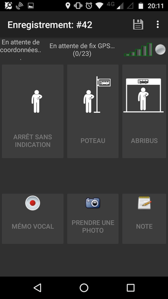

# osmtracker-layouts
This is a repository to host custom layouts for [OSMTracker](https://github.com/labexp/osmtracker-android) about public transport.

## Configuration

*French version:*
Pour ajouter ces dispositions dans l'application OSMTracker:
* dans `Paramètres` > `Boutons`, appuyer sur `+` en haut à droite
* appuyer ensuite sur la clef :wrench: en haut à droite
* cliquer sur `custom`, et renseigner les valeurs suivantes dans le formulaire de configuration :
  * github username : `Jungle-Bus`
  * repository name : `osmtracker-layouts`
  * branch name : `master`
* Sauvegarder
* Choisir à présent une disposition à ajouter à l'application, et la télécharger

Cette disposition est maintenant disponible dans la liste des dispositions, dans `Paramètres` > `Boutons`. Vous pouvez l'activer quand c'est nécessaire ;)

## List of layouts
### Bus route

