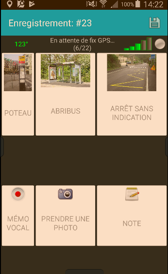

# bus_osmtracker_layout
Layout OSMTracker pour cartographier des lignes de bus

## Configuration

* Créer, s'il n'existe pas encore, le répertoire `layouts` dans le répertoire d'installation d'OSMTracker sur votre téléphone
* Déposer le contenu du répertoire *layouts* ici-présent dans le répertoire *layouts* du téléphone
* Dans l'application : Paramètres > Boutons > sélectionner "jungle_bus"

