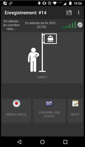

# osmtracker-layouts
This is a repository to host custom layouts for [OSMTracker](https://github.com/labexp/osmtracker-android) about public transport.

## Configuration

*French version:*
Pour ajouter ces dispositions dans l'application OSMTracker:
* dans `Paramètres` > `Boutons`, appuyer sur `+` en haut à droite
* appuyer ensuite sur la clef :wrench: en haut à droite
* cliquer sur `custom`, et renseigner les valeurs suivantes dans le formulaire de configuration :
  * github username : `Jungle-Bus`
  * repository name : `osmtracker-layouts`
  * branch name : `master`
* Sauvegarder
* Choisir à présent une disposition à ajouter à l'application, et la télécharger

Cette disposition est maintenant disponible dans la liste des dispositions, dans `Paramètres` > `Boutons`. Vous pouvez l'activer quand c'est nécessaire ;)

## List of layouts
### Bus route

### Ferry route

## Translate

Let's say you want to translate the bus route layout in your language, you will need to do the following:
- add a line with your language and a description in the [metadata file](https://github.com/Jungle-Bus/osmtracker-layouts/blob/master/layouts/metadata/bus_route.xml)
- duplicate the [en.xml file](https://github.com/Jungle-Bus/osmtracker-layouts/blob/master/layouts/bus_route/en.xml) and translate the `label` items

## See also

Once you have collected your tracks, you can use JOSM with the [Jungle stop presets](https://github.com/Jungle-Bus/josm-presets) to quickly create the route in OpenStreetMap :wink:

## Credits

This project has been developed by the [Jungle Bus](http://junglebus.io/) team.

The code in this repository is under the GPL-3.0 license.

If you value this work, show your support by donating to the [OSM French local chapter](http://openstreetmap.fr).

